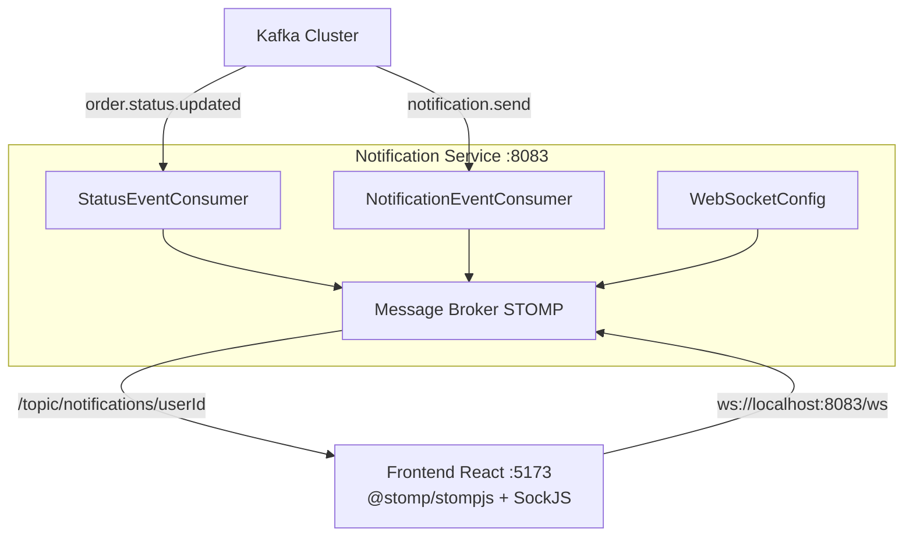
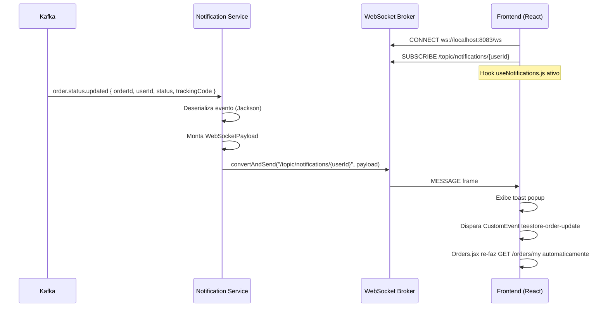

# TeeStore — Notification Service

Microservico de notificacoes em tempo real da plataforma TeeStore. Consome eventos do Kafka (`order.status.updated` e `notification.send`) e entrega mensagens ao navegador do cliente via **WebSocket STOMP sobre SockJS**, sem necessidade de polling.

---

## Sumário

- [Responsabilidade](#responsabilidade)
- [Arquitetura](#arquitetura)
- [Tecnologias](#tecnologias)
- [Padrões de Projeto](#padrões-de-projeto)
- [Fluxo de Notificação em Tempo Real](#fluxo-de-notificação-em-tempo-real)
- [WebSocket — Configuração](#websocket--configuração)
- [Variáveis de Ambiente](#variáveis-de-ambiente)
- [Como Rodar](#como-rodar)
- [Kafka — Tópicos](#kafka--tópicos)
- [Testes](#testes)

---

## Responsabilidade

Este servico opera na ponta final do pipeline de eventos. Ele nao conhece logica de negocio — apenas transforma eventos Kafka em mensagens WebSocket entregues ao browser do usuario correto.

```
Kafka: order.status.updated
               |
               v
    StatusEventConsumer
               |
               +-- Monta WebSocketPayload
               |
               +-- SimpMessagingTemplate.convertAndSend(
                       "/topic/notifications/{userId}", payload
                   )
               |
               v
    Browser do cliente (React)
    -> Toast popup
    -> Re-fetch automatico da lista de pedidos
```

---

## Arquitetura



---

## Tecnologias

| Camada | Tecnologia |
|---|---|
| Linguagem | Java 21 |
| Framework | Spring Boot 3.x |
| WebSocket | Spring WebSocket + STOMP + SockJS |
| Mensageria | Apache Kafka 3.5 |
| Threads | Virtual Threads (Java 21) |
| Build | Maven |
| Testes | JUnit 5 + Mockito |

---

## Padrões de Projeto

**Injecao de Dependencia (DI)**
O `StatusEventConsumer` recebe `SimpMessagingTemplate` via construtor, nao via campo. O `ObjectMapper` e configurado no proprio construtor, tornando a classe totalmente testavel sem Spring context.

```java
public StatusEventConsumer(SimpMessagingTemplate messagingTemplate) {
    this.messagingTemplate = messagingTemplate;
    this.objectMapper = new ObjectMapper();
    this.objectMapper.registerModule(new JavaTimeModule());
}
```

**Strategy**
A construcao da mensagem para o usuario aplica Strategy via switch expression — cada status tem seu proprio comportamento isolado:

```java
private String buildMessage(String status, String orderId) {
    return switch (status) {
        case "SHIPPED"   -> "Seu pedido #" + shortId + " foi enviado!";
        case "DELIVERED" -> "Seu pedido #" + shortId + " foi entregue!";
        default          -> "Status do pedido #" + shortId + " atualizado para " + status;
    };
}
```

**Observer (via STOMP)**
O padrao Observer e implementado naturalmente pelo protocolo STOMP: o frontend se inscreve em `/topic/notifications/{userId}` e recebe notificacoes assim que o servico as publica. Nao ha polling, nao ha acoplamento direto.

**Separacao de Consumidores**
Dois consumers independentes (`StatusEventConsumer` e `NotificationEventConsumer`) processam topicos distintos, seguindo o Principio da Responsabilidade Unica.

---

## Fluxo de Notificação em Tempo Real



---

## WebSocket — Configuração

```
Endpoint de conexao: ws://localhost:8083/ws  (SockJS fallback)
Prefixo de destino:  /topic
Prefixo de app:      /app
```

**Topicos de subscricao:**

| Topico | Descricao |
|---|---|
| `/topic/notifications/{userId}` | Notificacoes em tempo real do usuario especifico |

**Payload enviado ao browser:**
```json
{
  "orderId": "uuid",
  "type": "ORDER_SHIPPED",
  "message": "Seu pedido #A1B2C3D4 foi enviado!",
  "trackingCode": "BR123456789PT",
  "sentAt": "2025-01-01T10:00:08"
}
```

---

## Variáveis de Ambiente

Copie `.env.example` para `.env`:

```env
SERVER_PORT=8083

# Kafka
KAFKA_BOOTSTRAP_SERVERS=localhost:29092,localhost:29093,localhost:29094
```

Este servico nao possui banco de dados proprio. E stateless — apenas transmite eventos.

---

## Como Rodar

**Pre-requisitos:** Java 21+, Maven 3.9+, Kafka rodando (ver `Projeto-Integrador-Infra`)

```bash
# 1. Suba a infraestrutura
cd Projeto-Integrador-Infra
docker compose up -d

# 2. Configure as variaveis
cd Projeto-Integrador-Notification-Service
cp .env.example .env

# 3. Execute
mvn spring-boot:run
```

O servico sobe em `http://localhost:8083`.

**Health check:** `GET http://localhost:8083/actuator/health`

---

## Kafka — Tópicos

| Topico | Direcao | Descricao |
|---|---|---|
| `order.status.updated` | **Consumidor** | Evento de mudanca de status de pedido (SHIPPED, DELIVERED) |
| `notification.send` | **Consumidor** | Notificacao generica para entrega ao usuario |

**Consumer group:** `notification-group`
**Configuracao:** 3 brokers, `auto.offset.reset=earliest`, Virtual Threads habilitadas

---

## Testes e Cobertura de Código

### Executar localmente

```bash
# Roda os testes e gera os relatórios de cobertura + execucao
mvn verify
```

Apos a execucao, dois relatorios sao gerados:

| Relatorio | Localizacao | Conteudo |
|---|---|---|
| **JaCoCo (cobertura)** | `target/site/jacoco/index.html` | Cobertura linha a linha |
| **Surefire (execucao)** | `target/site/surefire-report.html` | Resultado de cada teste |

```bash
# Abrir no navegador (Windows)
start target/site/jacoco/index.html
```

### CI/CD — GitHub Actions

O workflow `.github/workflows/ci.yml` executa automaticamente a cada push. Para acessar os relatorios:

```
Repositório → Actions → (workflow) → Artifacts
├── jacoco-coverage-report   ← descompacte e abra index.html
└── surefire-test-report     ← abra surefire-report.html
```

### Classes testadas (JUnit 5 + Mockito)

| Classe de Teste | Casos de Teste |
|---|---|
| `StatusEventConsumerTest` | Consumo de SHIPPED e DELIVERED, construcao correta do WebSocketPayload, entrega via SimpMessagingTemplate, tratamento de JSON invalido |
| `NotificationEventConsumerTest` | Consumo do topico notification.send, mapeamento correto do payload para o usuario destino |

---

*Projeto Integrador — Desenvolvido por Victor Hugo, Josue Felix e Guilherme Bastos*